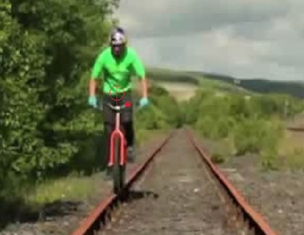

# PositionLabeling

An simple tool for labeling position.



## Requirements

* Python 3.6
* pygame


## Usage

1. Run application

    ```
    $ python run.py /path/to/images/dir /path/to/annotation.json
    ```

2. Start labeling

    * Press key `SPACE` to jump to next image
    * Press key `BACKSPACE` to jump to previous image
    * Click mouse button `LEFT` to put the sight
    * Press key `K_ESCAPE` to clear the sight
    * Press key `LEFT`, `UP`, `RIGHT`, `DOWN` to move the sight
    * Hold key `x` to speed up image jumping and sight moving
    * Press key `l` to toggle sight lock mode
        > lock icon near the sight indicates that lock mode is enabled or not
    * Press key `s` to save annotation
